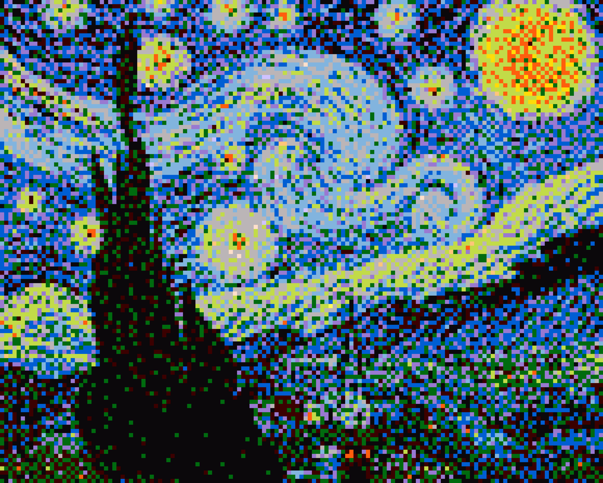

# koraliki #
Have you ever wanted to create some fine pics using Pyssla like beads? This tool is helping you with this task. Just provide an image, palette and tile size.
  
  
## How to use it? ##
1. Put an image you want to convert in the __img__ folder.
2. Create palette based on your own beads. Mine was tuned to Pyssla beads from Ikea.
3. Get the size of your tray. Pyssla tray can hold 29x29 beads.
4. Think if you want to make the image by tiling a few trays, eg. 3x2, default is 1x1.
5. Run the script (see **Examples**).
6. Go to _converted_ directory and find your image. If you defined tiling different than 1x1 then open the directory named like the file but with __TILED__ at its end.

## Examples ##
Syntax:

`./process.sh <IMAGE> [<PALETTE> [<TRAY_WIDTH>x<TRAY_HEIGHT> [<NO_TILES_HORIZONTALLY>x<NO_TILES_VERTICALLY>]]]`

Defaults are:
* PALETTE = palette/modified/all_saturated.png
* TRAY_WIDTH = 29
* TRAY_HEIGHT = 29
* NO_TILES_HORIZONTALLY = 1
* NO_TILES_VERTICALLY = 1

Example usage:

`./process.sh img/Starry_Night.jpg palette/modified/all_saturated2.png 18x18 3x2`

## Licensing ##
Copyright © 2017 Maciej Stanek

This work is free. You can redistribute it and/or modify it under theterms of the Do What The Fuck You Want To Public License, Version 2, as published by Sam Hocevar. See the LICENSE.md file for more details.
